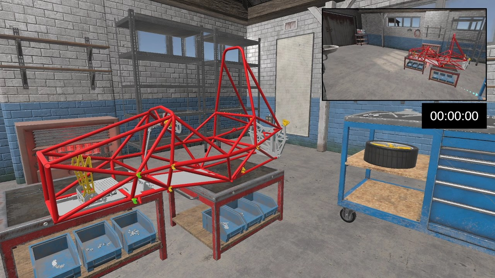

# VR Assembly
Created to assist a Mechanical Engineer during his MSc Mechanical Engineering degree.

This VR project was created to compare the time taken within a VR Assembly program with the time it takes in real life for his dissertation. 

The project uses the Unity Steam VR Plugin to provide basic interactions and VR functionality, this is then enhanced with some custom script to provide a guided and intuitive assembly procedure. 

## Video Preview

Click to watch on Youtube

## Dependencies
  * Bakery Lightmapper